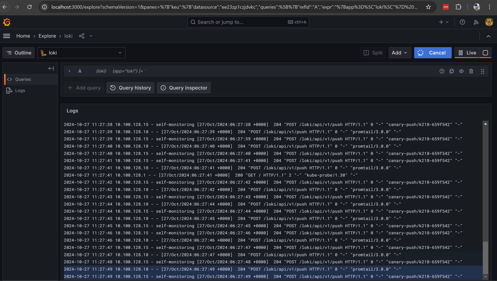

## Приложение к домашнему заданию

### Вывод команд kubectl 
1. `kubectl get node -o wide --show-labels` 
    ```shell
    NAME                        STATUS   ROLES    AGE   VERSION   INTERNAL-IP   EXTERNAL-IP      OS-IMAGE             KERNEL-VERSION      CONTAINER-RUNTIME     LABELS
    cl1nmo7vtmsm1b565r2f-ycyv   Ready    <none>   21m   v1.30.1   10.129.0.17   89.169.166.166   Ubuntu 20.04.6 LTS   5.4.0-187-generic   containerd://1.6.28   beta.kubernetes.io/arch=amd64,beta.kubernetes.io/instance-type=standard-v3,beta.kubernetes.io/os=linux,failure-domain.beta.kubernetes.io/zone=ru-central1-b,kubernetes.io/arch=amd64,kubernetes.io/hostname=cl1nmo7vtmsm1b565r2f-ycyv,kubernetes.io/os=linux,node.kubernetes.io/instance-type=standard-v3,node.kubernetes.io/kube-proxy-ds-ready=true,node.kubernetes.io/masq-agent-ds-ready=true,node.kubernetes.io/node-problem-detector-ds-ready=true,topology.kubernetes.io/zone=ru-central1-b,yandex.cloud/node-group-id=catakqq9cue3ao5n53g4,yandex.cloud/pci-topology=k8s,yandex.cloud/preemptible=false
    cl1s4tneea2jpq5geoom-epik   Ready    <none>   18m   v1.30.1   10.129.0.34   158.160.31.90    Ubuntu 20.04.6 LTS   5.4.0-187-generic   containerd://1.6.28   beta.kubernetes.io/arch=amd64,beta.kubernetes.io/instance-type=standard-v3,beta.kubernetes.io/os=linux,failure-domain.beta.kubernetes.io/zone=ru-central1-b,kubernetes.io/arch=amd64,kubernetes.io/hostname=cl1s4tneea2jpq5geoom-epik,kubernetes.io/os=linux,node.kubernetes.io/instance-type=standard-v3,node.kubernetes.io/kube-proxy-ds-ready=true,node.kubernetes.io/masq-agent-ds-ready=true,node.kubernetes.io/node-problem-detector-ds-ready=true,topology.kubernetes.io/zone=ru-central1-b,yandex.cloud/node-group-id=cato06scn6cr4aokri6i,yandex.cloud/pci-topology=k8s,yandex.cloud/preemptible=false
    ```
1. `kubectl get nodes -o custom-columns=NAME:.metadata.name,TAINTS:.spec.taints`
    ```shell
    NAME                        TAINTS
    cl1nmo7vtmsm1b565r2f-ycyv   [map[effect:NoSchedule key:node-role value:infra]]
    cl1s4tneea2jpq5geoom-epik   <none>
    ```
### Установка Loki Promtail и Grafana
TODO: Приложить репозитарий установки, команду установки и values.yaml

Добавить и обновить репозитарий установки Loki
```shell
helm repo add grafana https://grafana.github.io/helm-charts
helm repo update grafana
```
Установить Loki ([файл values.yaml](helm-values-loki.yaml))
```shell
helm upgrade --install --values helm-values-loki.yaml --set 'loki.storage.s3.accessKeyId=***,loki.storage.s3.secretAccessKey=***' loki grafana/loki
```
Установить PromTail ([файл values.yaml](helm-values-promtail.yaml))
```shell
helm upgrade --install --values helm-values-promtail.yaml promtail grafana/promtail
```
Установить Grafana ([файл values.yaml](helm-values-grafana.yaml))
```shell
helm upgrade --install --values helm-values-grafana.yaml --set 'adminPassword=***' grafana grafana/grafana
```
### Скриншот экрана Grafana
